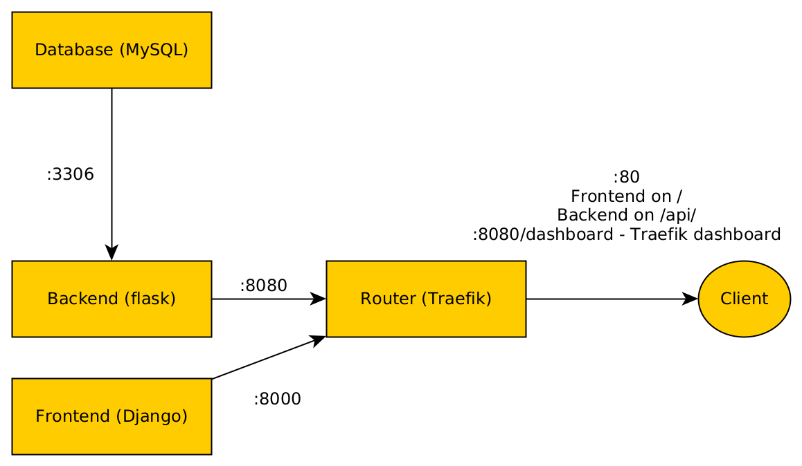
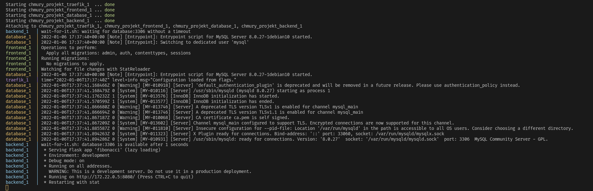
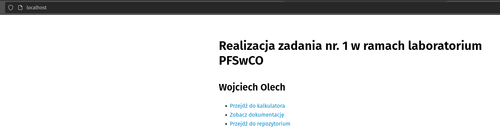
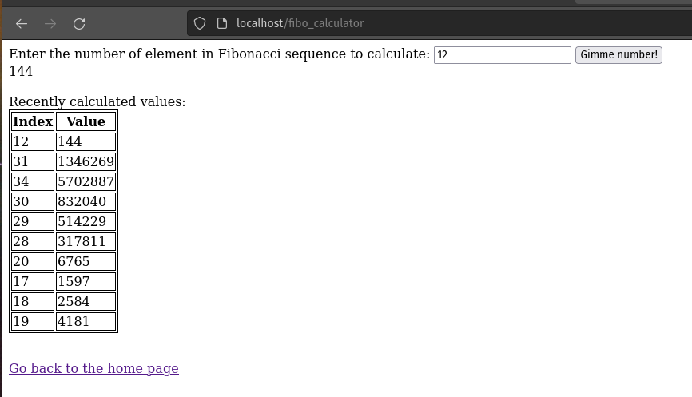

# CloudLab - Project 1

This project consists of 4 containers that create a webapp that calculates Fibonacci sequence values.

The containers are:

* Backend - written in Flask
* Frontend - written in Django
* Database - MySQL
* Traefik - as a proxy and router for the application

## Application schematic

## Running this app

This application provides an `docker-compose.yml` file, that allows to run it via `docker-compose up --build` command. That's basically all you should have to do in order to start this app - *it just works*.

...however, if for any reason it doesn't *just work*, you should try killing the app and starting it again. I've noticed that sometimes the database and traefik does not start up as they should, which also causes the backend to not start (since it waits for database to wake up). If you'll get a nice wall of logs from traefik and/or database - kill the app and run it again, it should start up normally.

Also, at first boot, MySQL will probably take some time to get running - few minutes and few reboots approximately - don't worry about it, backend will wait for it. If nothing will happen for few minutes, you can start worrying and restart the app.

## Documentation

### Frontend

Frontend is written in Python using Django framework. It hosts three pages:

* `/` - index, an info page with references to fibonacci calculator, project documentation and link to Github repository
* `/fibo_calculator` - fibonacci calculator
* `/documentation` - documentation, copy of [`README.md`](https://github.com/SteelPh0enix/CloudLabProject1) from repository in HTML format - this page/file

There's not much i could write about it, it's a trival Django app which just hosts few almost-fully-static pages. I don't even use templates a lot there, it doesn't explicitly uses database so migrations are completely optional. It's an absolute overkill, but it works.

Frontend's Docker image is based on official Python 3.9 image, running under Alpine Linux, to minimize it's size. The application is running in virtual environment, all the dependencies are stored in `requirements.txt` (generated via `pip freeze > requirements.txt`), and are automatically installed on container's build. The development environment is based on `pipenv`, so for local dev i suggest to use it instead of `virtualenv` - all the files are there, just run `pipenv update` and `pipenv shell` to get started. Make sure to update the `requirements.txt` after adding/removing/updating libraries in `pipenv`.

### Backend

Backend is also written in Python, using Flask framework. It's based on the same Docker image as frontend. It hosts two endpoints, which are described in below table:

**IMPORTANT NOTICE: Traefik routes the backend on `/api` - so, if you're running the whole app with `docker-compose`, you have to add `/api` before the endpoint path to get valid one, for example `/api/calculate` instead of `/calculate`**

| Endpoint                  | Example         | Response                                                                       | Description                                                                                                                       |
|---------------------------|-----------------|--------------------------------------------------------------------------------|-----------------------------------------------------------------------------------------------------------------------------------|
| `/calculate/<number:int>` | `/calculate/10` | `{ "requested": 10, "requested_value_too_big": false, "value": 55 }`           | Calculates the value of `number`th element in fibonacci sequence and returns a JSON response.                                     |
|                           | `/calculate/51` | `{ "requested": 51, "requested_value_too_big": true, "value": 0 }`             | Requested value limit is 50, hard-coded.                                                                                          |
| `/history/<items:int>`    | `/history/5`    | `{ "count": 2, "items": [{"index": 3, "value": 2}, {"index": 5, "value": 5}]}` | Returns a JSON with item count, and list of fibonacci's sequence values and it's indexes sorted by date and time of calculation.  |
|                           | `/history/5`    | `{ "count": 0, "items": []}`                                                   | If there's no items in history, list will be empty.                                                                               |

Backend is also simple, but a bit more complicated than frontend. It uses `SQLAlchemy` as database ORM. If ran via `docker-compose` it'll use provided `wait-for-it.sh` script to wait until MySQL database becomes operational, since Docker will wait only for the database container to start - MySQL bootup is relatively long, so without this delay the backend would immediatelly crash, as it wouldn't be able to connect to database on startup.

After calculating a value, it'll be stored in database and timestamped. The history of calculations can be fetched via endpoint, in JSON format, as described above.

Backend will not calculate the same value twice, it'll return the cached value if available. To verify that, you can ask the backend to calculate a value bigger than 30 (usually takes a while), and then ask it to calculate it again - it should be instant.

### Database

The database is based on official MySQL image. It doesn't really require any description, it's very simple setup based on official example.

### Traefik

Traefik is a router/proxy service that puts the app services togeher under a single port in current configuration. Traefik config can be found in [`hosts/localhost.yml`](https://github.com/SteelPh0enix/CloudLabProject1/hosts/localhost.yml) file (click to see this file in repo). It routes both frontend and backend on port 80, frontend on `/` and backend on `/api`.

It also provides a handy web interface to see it's current status - go to <http://localhost:8080/dashboard> to see it.

You can also see it's logs in `traefik_data/access.log` file, which will automatically appear after running the container.

## Screenshots

### Correct startup log

### Main page

### Calculator

